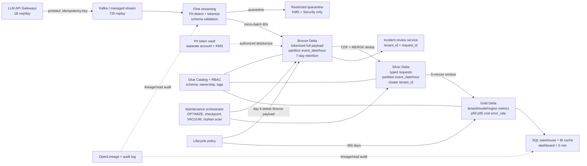

# Architecture Brief — Lakehouse quan sát LLM ở quy mô 1 tỷ request/ngày

**Học viên:** Phùng Gia Bảo — 2A202602386  
**Mã bài:** K4-Track02-Day18 — Bonus, Topic A  
**Vai trò:** Architect on-call  
**Phạm vi:** Thiết kế giả định để bảo vệ trong design review; chưa phải báo giá hay chứng nhận tuân thủ production.

## 1. Problem statement

Nền tảng phục vụ **1 tỷ LLM request/ngày**, trung bình **5 KB/request**, tương đương
**5 TB raw/ngày** và lưu lượng trung bình khoảng **58 MB/s**; thiết kế chịu peak 3×,
khoảng 174 MB/s. Dashboard cost, latency và error rate theo tenant phải refresh trong
5 phút. Prompt/response đầy đủ được giữ 7 ngày để điều tra incident; sau đó phải xóa,
trong khi aggregate được giữ 365 ngày. PII phải được phát hiện và token hóa trước khi
bất kỳ analyst nào có thể đọc dữ liệu. Budget storage là cap cứng **5.000 USD/tháng**.

Bài toán khó vì ba đường tải xung đột: ingest cần append liên tục, dashboard cần scan
nhỏ và nhanh theo tenant, còn incident review cần đọc payload lớn theo request ID.
Nếu ghi từng request thành file, hệ thống tạo small-file storm; nếu gom batch quá lâu,
SLA 5 phút bị phá. Retention phải xóa được payload lẫn bản sao và index dẫn xuất mà
không làm mất aggregate một năm. Thiết kế phải có transaction log, schema enforcement,
time travel có retention hữu hạn, lineage và bằng chứng rằng PII chưa đi qua ranh giới
Bronze bảo vệ.

## 2. Assumptions và SLO

Các con số dưới đây là input cho capacity planning, không phải số đo production:

| Hạng mục | Giả định / SLO |
|---|---:|
| Request | 1 tỷ/ngày; trung bình 5 KB |
| Raw ingest | 5 TB/ngày; 58 MB/s average; 174 MB/s peak |
| Nén Bronze | Zstandard/Parquet 2,5:1 → 2 TB/ngày |
| Silver hot | 1,2 TB/ngày sau parse, bỏ cột không cần cho analytics |
| Gold | 50 GB/ngày sau aggregate theo cửa sổ 5 phút |
| Freshness | p95 event-to-dashboard < 5 phút |
| Incident lookup | p95 < 10 giây theo `tenant_id + request_id`, 7 ngày |
| Raw retention | 7 ngày rồi xóa vật lý sau safety window 24 giờ |
| Aggregate retention | 365 ngày |
| Availability | Dashboard 99,9%; không mất committed event |
| Storage budget | ≤ 5.000 USD/tháng, gồm 25% headroom |

Giá dùng để ước lượng: S3 Standard **0,025 USD/GB-tháng** và Standard-IA
**0,0138 USD/GB-tháng**, gần mức công khai ở khu vực châu Á nhưng được làm tròn để
planning. Query serverless dùng **5 USD/TB scanned**, đúng mô hình giá trong ví dụ
chính thức của Athena. Giá phải được chạy lại bằng calculator tại region triển khai
trước khi ký ngân sách.

## 3. Kiến trúc đề xuất

Các concept Day18 được áp dụng cụ thể: **medallion** tách payload và metric;
**Delta ACID/CDF/MERGE** cho ingest idempotent; **schema enforcement/evolution** tại
Flink và table; **partition + clustering** cho hot path tenant; **time travel với
retention hữu hạn** để rollback; **maintenance** cho small files/checkpoint/orphan;
**catalog** làm control plane; **lineage/provenance** nối source, transformation và
dashboard; **FinOps lifecycle** xóa payload sau 7 ngày.

## 4. Các quyết định kiến trúc và alternatives bị loại

### Quyết định 1 — Delta Lake cho Bronze, Silver và Gold

Tôi chọn **Delta Lake** vì streaming micro-batch, schema enforcement, `MERGE`, CDF,
OPTIMIZE và RESTORE khớp trực tiếp với pipeline. Transaction log cung cấp bằng chứng
commit và cho phép rollback một batch lỗi mà không sửa file bằng tay.

- Tôi loại **Parquet thuần** vì không có transaction log, atomic commit, schema
  enforcement hay row-level MERGE; retry có thể để lại trạng thái nửa thành công.
- Tôi loại **Iceberg** cho MVP vì hidden partitioning và catalog interoperability rất
  tốt nhưng pipeline này cần CDF và operational path Delta đã được đội vận hành kiểm
  chứng. Nếu Trino/Flink multi-engine trở thành yêu cầu chính, Iceberg sẽ được đánh giá
  lại; đây không phải kết luận Delta luôn tốt hơn.
- Tôi loại **Apache Hudi** vì incremental pull phù hợp CDC, nhưng thêm một operational
  stack và compaction mode mới trong khi CDF của Delta đã đủ cho hai consumer hiện tại.

### Quyết định 2 — Flink stateful streaming, commit Delta mỗi 60 giây

Tôi chọn **Flink + managed Kafka**, checkpoint mỗi 30 giây và Delta micro-batch 60 giây.
Kafka giữ 72 giờ để replay. Idempotency key là `(tenant_id, request_id)`; Silver dùng
MERGE để retry không nhân đôi cost. 60 giây để lại hơn ba phút cho Silver, Gold và BI
cache trong SLA 5 phút.

- Tôi loại **ghi trực tiếp từ API gateway vào object storage** vì producer retry sẽ tạo
  duplicate/small files, không có backpressure và không có replay boundary độc lập.
- Tôi loại **batch 15 phút** vì rẻ và tạo file đẹp hơn nhưng tự nó đã phá SLA 5 phút.
- Tôi loại **mỗi event một Lambda** vì 1 tỷ invocation/ngày làm tăng request cost,
  throttling surface và nguy cơ tạo 1 tỷ object nhỏ.

### Quyết định 3 — Partition theo thời gian, cluster theo tenant

Bronze/Silver partition theo `event_date` và `event_hour`; Silver được liquid-cluster
hoặc Z-order theo `(tenant_id, request_id)`. Gold partition theo `metric_date`, cluster
theo `(tenant_id, window_start)`. Writer nhắm file **256–512 MB** và không partition
trực tiếp theo tenant.

- Tôi loại **partition theo `tenant_id`** vì cardinality lớn tạo hàng trăm nghìn
  partition nhỏ và metadata/listing storm; tenant nhỏ gần như không bao giờ đạt target
  file size.
- Tôi loại **chỉ partition theo ngày** vì mỗi partition Bronze chứa tới 2 TB compressed;
  incident lookup trong ngày phải plan quá nhiều file và hourly retention khó thực hiện.
- Tôi loại **một file khổng lồ cho mỗi giờ** vì giảm file count nhưng mất parallelism và
  file-level pruning; rewrite một file quá lớn cũng làm OPTIMIZE/VACUUM đắt hơn.

### Quyết định 4 — Tokenize PII trước Bronze, vault tách biệt

Flink dùng detector có version để thay số điện thoại, email và định danh bằng token
deterministic có scope tenant. Mapping token↔PII nằm trong vault ở tài khoản bảo mật
riêng, mã hóa bằng KMS; analyst chỉ thấy token. Dòng detector không quyết định được bị
đưa vào quarantine, không được “fail open”. Mọi detokenize cần ticket, purpose và audit.

- Tôi loại **redact ở Silver** vì raw Bronze đã trở thành một bản sao PII mà analyst hoặc
  job vận hành có thể đọc trước khi redaction chạy.
- Tôi loại **hash không salt** vì dữ liệu miền nhỏ như số điện thoại có thể bị dictionary
  attack và không hỗ trợ thu hồi/rotate mapping có kiểm soát.
- Tôi loại **xóa vĩnh viễn mọi PII ngay tại gateway** vì incident review hợp lệ đôi khi
  cần tái liên kết dưới quyền Security; token vault giữ chức năng đó mà không mở PII cho
  analytics.

### Quyết định 5 — Retention bằng table delete + VACUUM + orphan verification

Payload Bronze có `expires_at = event_time + 7 ngày`. Job hằng giờ xóa logical rows đã
hết hạn; VACUUM chạy sau safety window 24 giờ; job độc lập so sánh file trên storage với
active files trong Delta log để tìm orphan chưa từng commit. Silver payload cũng giữ 7
ngày; Gold giữ 365 ngày và chuyển sang Standard-IA sau 30 ngày.

- Tôi loại **chỉ dùng S3 lifecycle trên prefix** vì lifecycle không hiểu Delta active
  files; xóa object còn được log tham chiếu sẽ làm hỏng bảng.
- Tôi loại **chỉ chạy VACUUM** vì delta-rs có thể không nhìn thấy orphan chưa từng commit,
  đúng failure đã đo ở NB6.
- Tôi loại **giữ raw 30 ngày “để an toàn”** vì đi ngược yêu cầu 7 ngày, tăng blast radius
  PII và tăng ít nhất 46 TB compressed steady-state.

### Quyết định 6 — Glue Catalog là control plane, không phải nơi chứa data

Glue Catalog giữ table identity, schema, owner và tags `pii`, `retention`, `cost_center`.
IAM/Lake Formation cấp quyền theo role; OpenLineage ghi lineage từ stream đến dashboard.
Schema change tương thích ngược được CI kiểm tra; rename/drop cần contract version và
impact report.

- Tôi loại **filesystem paths làm catalog** vì rename, ownership, discovery và access
  policy sẽ bị phân tán trong code của từng job.
- Tôi loại **Hive Metastore tự quản** vì phải tự chịu HA, backup và upgrade cho control
  plane 24/7.
- Tôi chưa chọn **Unity Catalog** vì tăng lock-in cho một pipeline chủ yếu chạy Flink và
  open-source Delta; sẽ xem lại nếu toàn bộ compute chuyển sang Databricks.

### Quyết định 7 — Gold materialized 5 phút, không cho dashboard scan Silver

Gold lưu p50/p95 latency, token, cost và error rate theo
`(window_start, tenant_id, model, region)`. Streaming job cập nhật cửa sổ 5 phút; BI cache
refresh sau commit. Dashboard account không có quyền đọc prompt/response.

- Tôi loại **dashboard query trực tiếp Silver** vì scan dữ liệu request-level vừa đắt,
  vừa khó đạt latency ổn định, vừa mở rộng phạm vi truy cập payload.
- Tôi loại **chỉ dùng cache không có Gold table** vì cache không phải system-of-record,
  khó time travel/recompute và mất provenance của metric.
- Tôi loại **precompute một bảng cho mỗi dashboard** vì trùng logic cost/error và tạo
  nhiều metric definition không nhất quán.

## 5. Ước lượng storage và compute

### 5.1 Storage steady-state

Đơn vị dùng 1 TB ≈ 1.000 GB để phép tính dễ audit.

| Thành phần | Phép tính | Dung lượng | Giá giả định | USD/tháng |
|---|---:|---:|---:|---:|
| Bronze full payload | 5 TB/ngày ÷ 2,5 × 7 ngày | 14 TB | 25 USD/TB | 350 |
| Silver typed hot | 1,2 TB/ngày × 7 ngày | 8,4 TB | 25 USD/TB | 210 |
| Gold 365 ngày | 50 GB/ngày × 365 | 18,25 TB | 13,8 USD/TB | 252 |
| Token vault + catalog | 0,5 TB | 0,5 TB | 25 USD/TB | 13 |
| Delta logs/checkpoints | 3% × 40,65 TB | 1,22 TB | 25 USD/TB | 31 |
| **Subtotal** | | **42,37 TB** | | **856** |
| Headroom rewrite/time travel | 25% × 856 | | | **214** |
| Request/lifecycle reserve | 20% × 856 | | | **171** |
| **Storage planning total** | | | | **1.241 USD/tháng** |

Kết quả còn **3.759 USD/tháng** dưới cap 5.000 USD. Khoảng trống không được xem là lý
do tăng retention: nó hấp thụ region price, request charge, replication và compression
thực tế kém hơn. Stress test xấu hơn với nén chỉ 1,5:1 làm Bronze 23,3 TB; tổng storage
vẫn xấp xỉ 1.600 USD/tháng trước replication. Cross-region replication full raw sẽ gần
nhân đôi storage, nên không nằm trong MVP; Kafka 72 giờ và backup catalog là recovery
boundary ban đầu.

### 5.2 Compute và query — ngoài cap storage

Compute được theo dõi riêng để tránh “storage rẻ” che giấu pipeline đắt:

- Streaming: 32 worker × 0,34 USD/giờ × 730 giờ = **7.942 USD/tháng**.
- Maintenance: 10 worker × 0,34 USD/giờ × 4 giờ/ngày × 30 = **408 USD/tháng**.
- Gold query validation: giả sử 0,2 TB/ngày × 5 USD/TB × 30 = **30 USD/tháng**.
- Tổng compute/query planning: **8.380 USD/tháng**, chưa gồm managed-stream surcharge.

Ở 5 TB/ngày, ingest thô trung bình là 58 MB/s; 32 worker chỉ cần xử lý trung bình
1,8 MB/s/worker và chịu peak khoảng 5,4 MB/s/worker. MVP benchmark phải chứng minh CPU
PII detection, không phải network, có đủ headroom. Athena tính phí theo bytes scanned;
Parquet compression và column pruning vì vậy giảm trực tiếp query cost, theo ví dụ giá
chính thức của AWS.

## 6. Failure modes lúc 03:00

| Failure | Detection cụ thể | Containment và rollback |
|---|---|---|
| Detector PII version mới bỏ sót số điện thoại | Canary corpus mỗi deploy; metric `pii_quarantine_rate`; DLP scan mẫu Bronze báo raw-pattern > 0 | Dừng promote Bronze→Silver, revoke analyst role trên affected hours, RESTORE về Delta version trước deploy, replay Kafka bằng detector cũ; rotate token nếu dữ liệu đã lộ |
| Schema producer đổi `latency_ms` từ integer sang string | Flink schema-reject tăng; Delta enforcement chặn commit; alert khi reject > 0,1%/5 phút | Quarantine schema mới, giữ consumer version cũ; producer rollback. Chỉ dùng schema evolution sau contract review, không hạ enforcement |
| Retry tạo duplicate và dashboard cost tăng gấp đôi | Uniqueness monitor trên `(tenant_id, request_id)`; reconcile source count với Silver; cost/request lệch > 5% | Pause Gold, MERGE dedup Silver từ Bronze CDF, time travel so sánh version tốt rồi RESTORE Gold và recompute affected windows |
| Small-file storm sau autoscaling | File count/hour > 2× baseline hoặc median file < 128 MB; planning latency tăng | Giảm commit frequency có kiểm soát, chạy OPTIMIZE trên giờ bị ảnh hưởng, Z-order tenant; không gộp toàn ngày thành một file |
| VACUUM xóa file reader cũ còn cần | Preflight kiểm tra oldest active reader; dry-run file count/bytes; read-version errors | Dừng VACUUM, khôi phục object từ versioned bucket nếu còn; tăng safety window. Nếu object đã purge, replay Kafka trong 72 giờ và rebuild partition |
| Snapshot expiry báo thành công nhưng storage không giảm | So sánh active-file set với object listing; bytes/day không giảm sau 24 giờ | Chạy orphan sweep với age guard; không xóa file mới hơn 24 giờ; verify row count và checksum trước/sau |
| Tenant nóng làm skew và dashboard trễ > 5 phút | Lag theo Kafka partition và tenant; p95 processing time; Gold watermark | Salt hot tenant trong stream key, scale worker, merge salt ở Gold; dashboard dùng last-known-good window và gắn freshness timestamp |

Ba rollback dùng trực tiếp concept Day18: schema enforcement ngăn commit xấu; time travel
và RESTORE quay lại version tốt; CDF/MERGE tái lập Silver/Gold; maintenance có dry-run,
retention và orphan age guard.

## 7. MVP một tuần

MVP không cố đạt 1 tỷ request thật. Nó chứng minh cơ chế khó nhất: **PII không lọt qua
Bronze bảo vệ, retry không nhân đôi metric, và retention xóa payload nhưng giữ Gold**.

| Ngày | Deliverable |
|---|---|
| 1 | Chốt schemas/contracts; generator 10 triệu event có duplicate, malformed PII và ba tenant skewed |
| 2 | Kafka topic + Flink tokenization/quarantine; vault mock tách quyền; schema enforcement |
| 3 | Bronze/Silver Delta, CDF và idempotent MERGE theo request ID |
| 4 | Gold cửa sổ 5 phút; dashboard query và freshness watermark |
| 5 | OPTIMIZE/Z-order tenant, checkpoint, VACUUM dry-run và orphan detector |
| 6 | Failure injection: bad schema, duplicate retry, detector regression, writer crash |
| 7 | Load test, cost report, runbook rollback và design review |

### Acceptance criteria

1. 10 triệu input event, trong đó 1% duplicate, tạo đúng số `request_id` duy nhất ở
   Silver; Gold cost sai lệch < 0,1% so với oracle script.
2. Không có regex PII rõ trong Bronze/Silver mẫu 100%; dòng detector không chắc chắn nằm
   trong quarantine, không fail open.
3. p95 event-to-Gold < 5 phút ở 3× lưu lượng scale-model; dashboard chỉ đọc Gold.
4. Query một tenant prune ≥ 90% file trong partition giờ và nhanh hơn baseline ≥ 3× hoặc
   có pruning ratio ≥ 10×.
5. Bad schema bị chặn; RESTORE đưa bảng về checksum trước lỗi; replay Kafka không tạo
   duplicate.
6. Retention test với clock rút gọn xóa payload hết hạn khỏi current table; VACUUM dry-run
   và orphan scan liệt kê đúng fixture, còn Gold 365 ngày không đổi.
7. Storage projection theo bytes thực đo, sau khi scale lên 1 tỷ request/ngày và cộng 25%
   headroom, vẫn < 5.000 USD/tháng.

### Cách kiểm tra mechanism khó nhất

Test end-to-end cài 1.000 record chứa PII đã biết, 100 record ambiguous và 1.000
duplicate. Sau commit, test scan mọi string column Bronze/Silver bằng detector độc lập:
PII rõ phải bằng 0; ambiguous phải xuất hiện trong quarantine; Silver unique count phải
khớp oracle. Sau đó advance clock quá 7 ngày, chạy delete + VACUUM dry-run + orphan sweep,
kiểm tra payload biến mất khỏi current version nhưng Gold aggregate và audit record vẫn
còn. Cuối cùng inject một detector lỗi, xác nhận alert, dừng promotion và RESTORE về
version tốt trong dưới 15 phút.

## 8. Security, governance và phạm vi chưa giải quyết

- KMS key tách theo environment; token vault ở security account và không nằm trong
  lakehouse bucket.
- Analyst role chỉ đọc Gold; incident reviewer chỉ đọc Bronze qua service có purpose,
  ticket, tenant scope và immutable audit log.
- Catalog tags không tự tạo compliance. Cần privacy/legal review về mục đích xử lý,
  data-subject request, region và retention trước production.
- Thiết kế chưa giải quyết cross-region active-active, legal hold, model-evaluation logs
  và detokenization trong incident đa tenant. Đây là workstream sau MVP.
- Object versioning có thể giữ bản đã “xóa”; lifecycle của version cũ phải khớp yêu cầu
  xóa và được Security phê duyệt.

## 9. Nguồn và cơ sở giá

- AWS, **Amazon S3 pricing**: request, storage class và retrieval được tính riêng;
  region triển khai quyết định giá thực tế: https://aws.amazon.com/s3/pricing/
- AWS, **S3 cost optimization**: lifecycle có thể tự động transition hoặc expire object,
  nhưng table-level deletion vẫn phải tôn trọng Delta log:
  https://docs.aws.amazon.com/AmazonS3/latest/userguide/cost-optimization.html
- AWS, **Athena pricing**: ví dụ chính thức dùng 5 USD/TB scanned và minh họa lợi ích
  của compression + columnar projection: https://aws.amazon.com/athena/pricing/
- AWS, **Kinesis sizing**: capacity phụ thuộc record size, records/s và consumers; số
  worker trong brief phải được benchmark lại bằng workload thật:
  https://docs.aws.amazon.com/streams/latest/dev/how-do-i-size-a-stream.html
- K4 Track 02 Day 18 notebooks: NB2 (compaction/Z-order), NB4 (medallion), NB6
  (maintenance), NB8 (version pin/provenance).

## 10. Self-review theo rubric

- [x] Bảy quyết định; mỗi quyết định có ít nhất hai alternatives và tradeoff cụ thể.
- [x] Scale, SLA, retention và budget được dùng xuyên suốt; có storage và compute math.
- [x] Một diagram; áp dụng hơn bốn concept Day18 vào component cụ thể.
- [x] Bảy failure modes có detection và rollback; có time travel, schema và maintenance.
- [x] MVP một tuần có slice nhỏ, acceptance criteria và test mechanism khó nhất.
- [ ] Người nộp đã tự đọc, chỉnh giả định và có thể bảo vệ mọi quyết định trong review.

